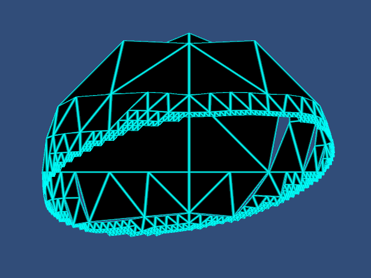

# Astrometry

Various projects related to astrometry. As far as I know, I'm the only one using this code. If you're using it, let me know and I'll start paying more attention to backward compatibility and formal versioning.

## Sphere

Based on [Indexing the Sphere with the Hierarchical Triangular Mesh](https://arxiv.org/ftp/cs/papers/0701/0701164.pdf) by Alexander Szalay et al, Microsoft Research Advanced Technology Division, 2005, and the reference implementation found at [SkyServer](http://www.skyserver.org/htm/). The reference implementation is not entirely open source. There are some DLLs in the `required` folder of the distribution archive that I haven't been able to find the source for.

The goal of this project is a clean, open source, and somewhat simplified implementation of the HTM. It's entirely written in C# and targets .NET Standard 2.0 for compatibility with platforms like Xamarin and Unity3D. The trixel IDs produced by this version differ from those produced by the reference implementation. Key differences include the algorithm for identifying the initial face of the octahedron, the order (and therefore names) of the initial faces, and the order in which the children of a trixel are tested. Instead of simplifying arbitrarily complex convexes as described in sections 3.2 through 3.8 of the paper, I only intend to support circular and rectangular covers. Indexing performance is comparable to the reference implementation. Computing covers is still in development and has not yet been aggressively optimized or benchmarked.

The `compat` branch was an experimental attempt to make this version produce the same trixel IDs as the reference implementation. Differences in the calculation of trixel IDs were isolated from differences in the conversion of RA/Dec to cartesian coordinates. At depth 20 there were approximately 160 different trixel IDs per million random RA/Dec coordinates. Approximately 120 of these differences occurred at depth 20 (that is, in the least significant 2 bits of the trixel ID) with approximately 1/4 as many differences occurring at each shallower depth. The remaining differences may be due to things like the choice of ray-triangle intersection algorithm, epsilon values, and the exact order of operations. To run these tests yourself, you'll need to download the reference implementation and update the paths of the DLL references in the `Compat.Test` project. The API has evolved significantly since this branch, so if I try any more compatibility experiments it will be in a new branch.